# Visual Studio Code와 Azure App Service로 웹 앱 배포하기

## 🚀 1. 새로운 ASP.NET 프로젝트 제작하기

먼저, 프로젝트를 생성해줍니다.

VSC에서 `Terminal` > `New Terminal`을 클릭하여 새로운 터미널 창을 열어주고, 아래의 명령어를 입력합니다.

```bash
dotnet new webapp -n myapp --framework net8.0
```

- 프로젝트 이름: `myapp`
- 프레임워크: dotnet 8

<br>

생성된 프로젝트를 확인해봅시다.

```bash
dotnet run
```

다음과 같이 localhost에서 생성된 웹 앱을 확인할 수 있습니다.

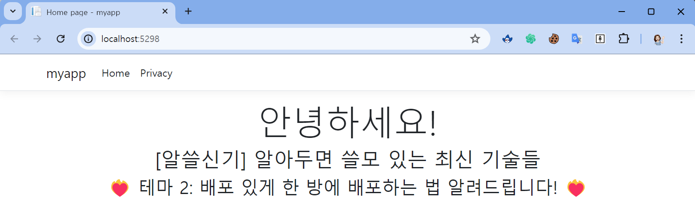

## 🚀 2. 웹 배포하기 with VSC

> 꼭 **프로젝트의 루트 디렉터리**를 VSC로 열어준 다음에 실행해주세요!

명령팔레트 (Ctrl + Shift + P)에서 **`Azure App Service: Create New Web App`** 을 선택해줍시다.

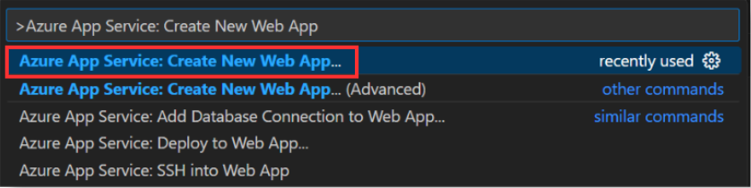

<br>

웹 앱 리소스 이름을 설정해줍시다. <br> 이 리소스 이름은 전역적으로 유일한 이름이어야 합니다.

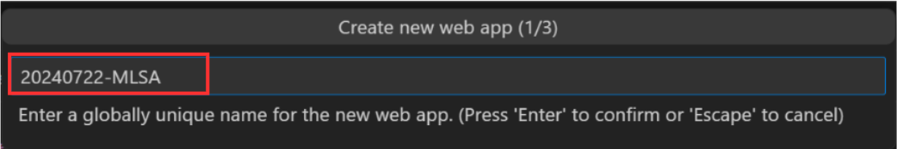

<br>

runtime stack을 선택해줍시다. 이번 실습에서는 .NET 8 버전을 선택해주었기 때문에 `.NET 8 (LTS)`를 선택해주었습니다.

- 해당 스택은 앞서 제작한 웹 앱의 스택에 맞게 선택해주면 됩니다.

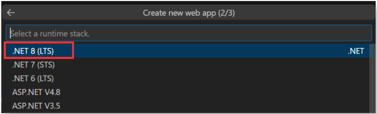

<br>

가격 정책은 Free(F1)을 선택해주겠습니다. <br>
실습에서는 무료 플랜을 선택했지만, 실제로는 상황에 맞게 플랜을 선택해주시면 됩니다.

- [Azure App Service 가격 정책](https://azure.microsoft.com/pricing/details/app-service/windows/?wt.mc_id=studentamb_296881)

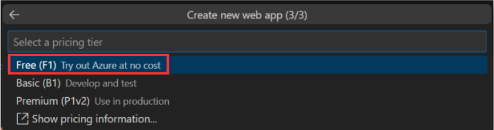

<br>

`Deploy` 버튼을 누른 뒤, 배포할 프로젝트 폴더를 선택해주면 배포를 시작합니다.

- 버튼 클릭

  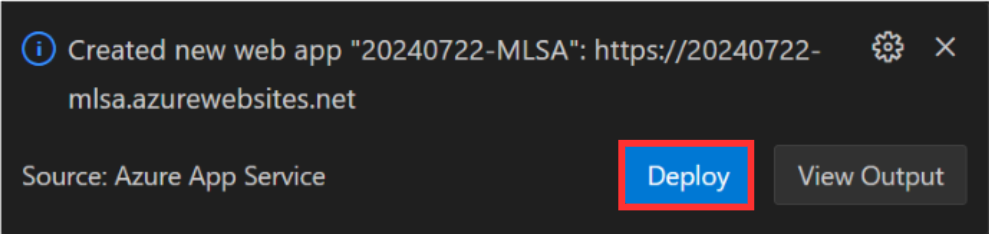 <br><br>

- 프로젝트 폴더 선택

    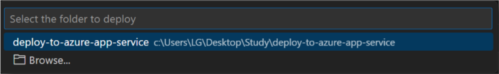

여기서 만약 추가 Configure 파일이 필요하다는 창이 뜬다면, Add Config 버튼을 선택해주면 됩니다.

- `Required configuration to deploy is missing from "~~"`

## 🚀 3. 배포 완료!

Azure App Service에 들어가면 설정한 리소스를 확인할 수 있습니다.

생성한 리소스를 클릭하면 기본 제공된 도메인과 요금 정보, 운영 체제등을 확인할 수 있습니다.

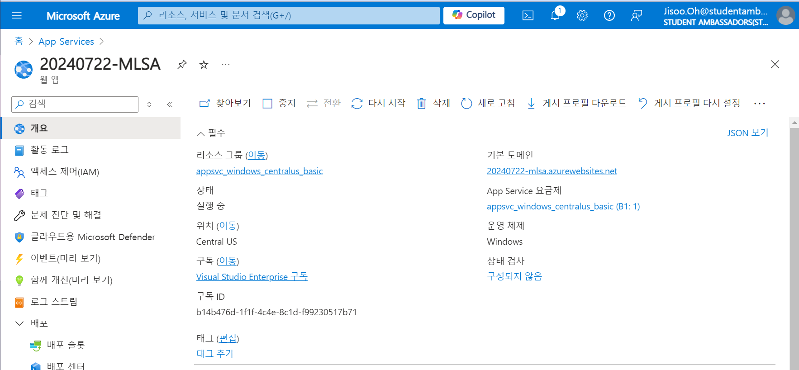 <br>

도메인을 클릭하여 배포된 웹 페이지를 확인해보면, 아래와 같이 확인할 수 있습니다.

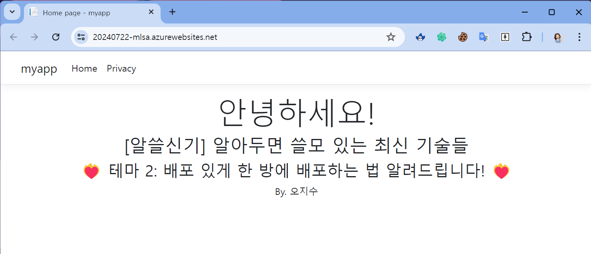

## 🚀 4. Github Actions를 통한 CI/CD 파이프라인 구축

설정 > 구성에서 웹 앱에 맞게 스택 및 버전을 선택해줍니다.

- `.NET` , `.NET 8 (LTS)` 선택

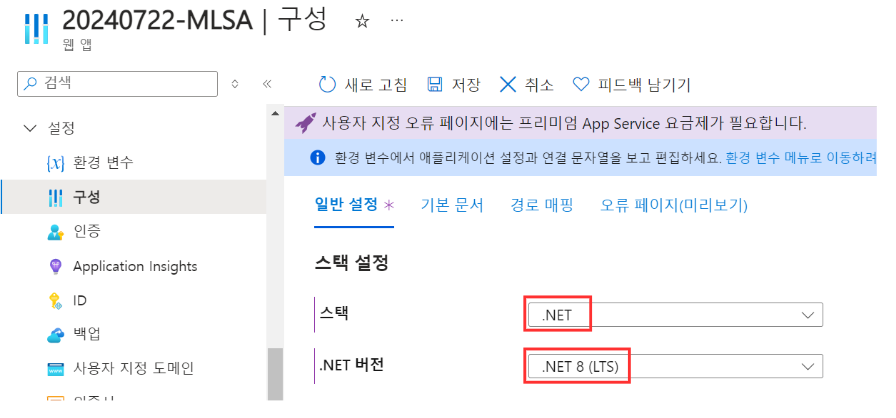

<br>

배포 > 배포 센터에서 소스를 GitHub로 선택해줍니다. <br>
자신의 깃허브 계정으로 로그인하고, 프로젝트 **리포지토리** 및 **브랜치**를 설정해줍니다.

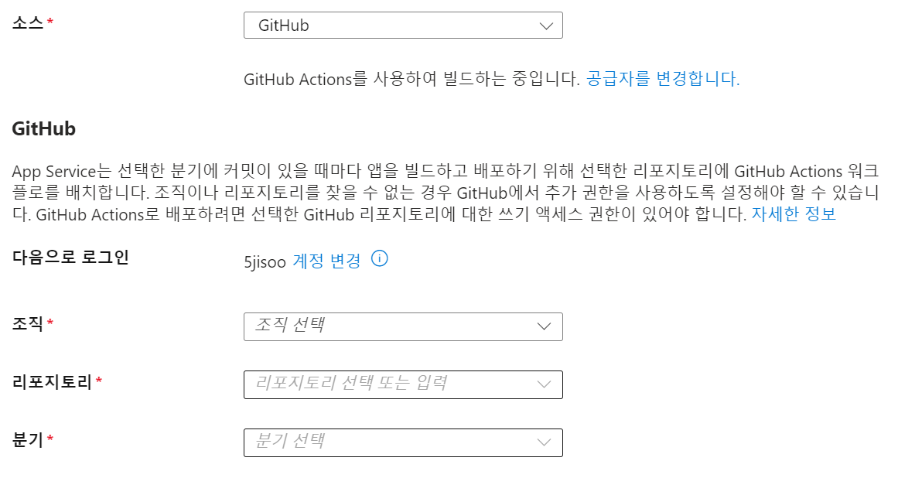

<br>

워크플로 구성 하단, `파일 미리보기` 버튼을 클릭하면 설정한 스택, 브랜치에 맞게 워크플로 스크립트를 자동으로 생성해줍니다.

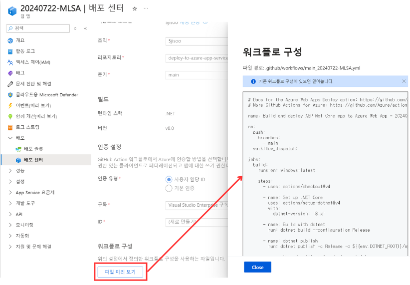

배포 설정을 저장하면, 설정한 레포지토리의 `.github/workflows` 폴더에 yml 파일 (워크플로 스크립트)가 생성됩니다.

<br>

※ 생성된 스크립트에서 파일 경로 문제가 발생한다면?

1. 기존 runs-on이 `windows-latest`로 설정되어 있습니다. 이를 `ubuntu-latest`로 변경하거나, 혹은 아래 파일 경로 중 `/ (슬래시)`를 `\ (역슬래시)`로 변경해주세요

2. myapp 부분을 초반에 설정한 ASP.NET **프로젝트 명**으로 변경해주세요

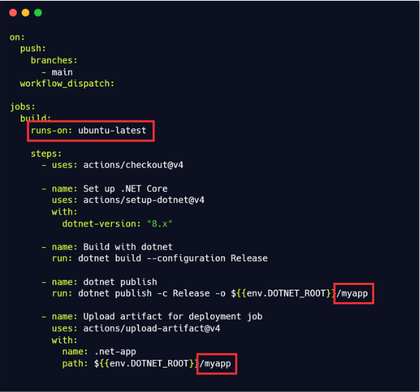

<br>

변경사항을 반영하고, 커밋 - 푸시를 진행하면 Github Actions이 돌아갑니다. <br>

deploy 단계에 보이는 웹사이트에 접속하면 변경된 부분이 반영된 것을 확인할 수 있습니다.

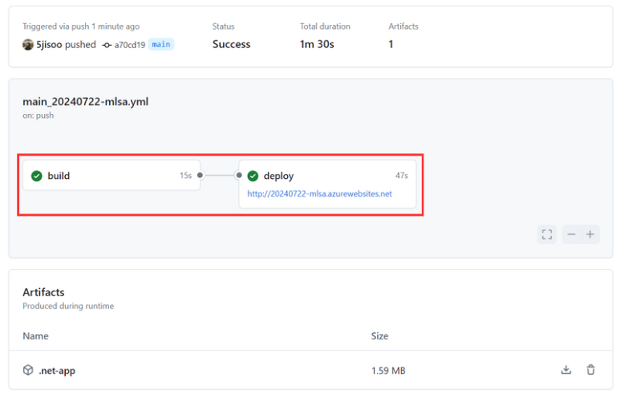
